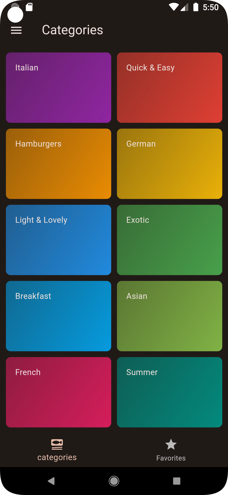
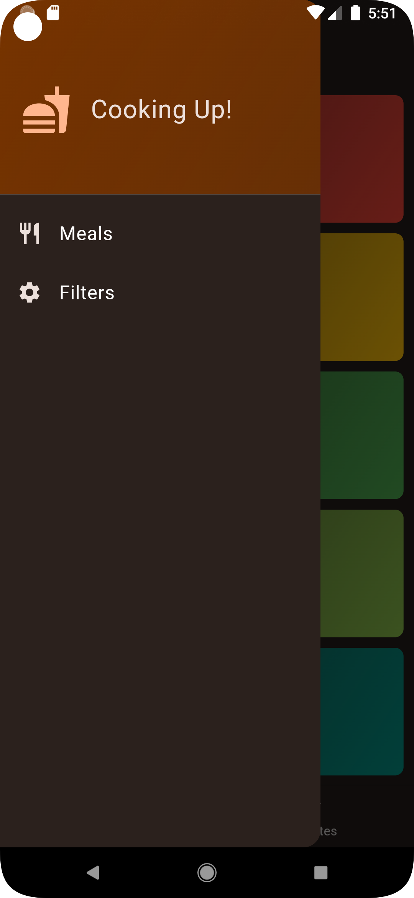
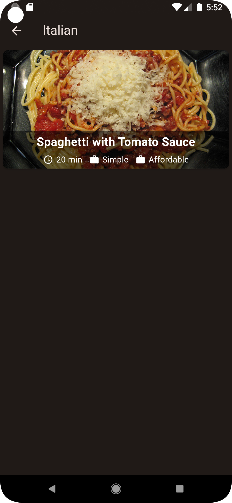
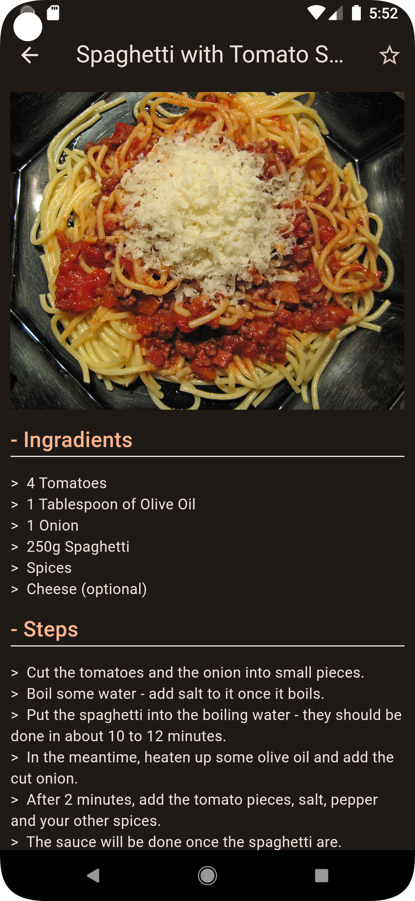
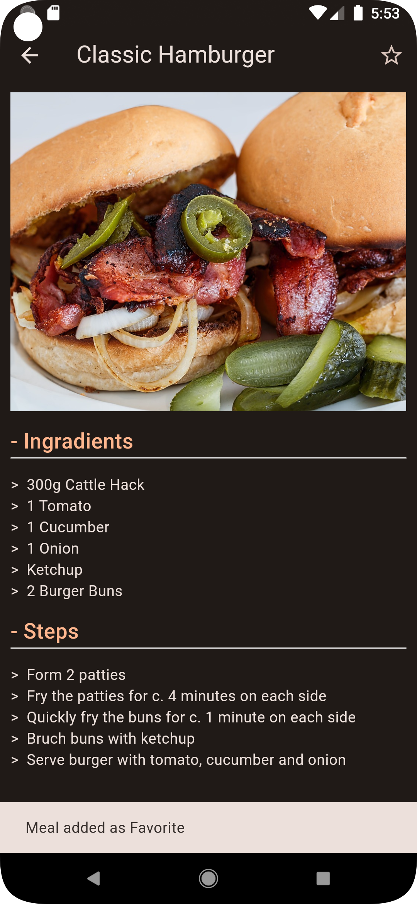
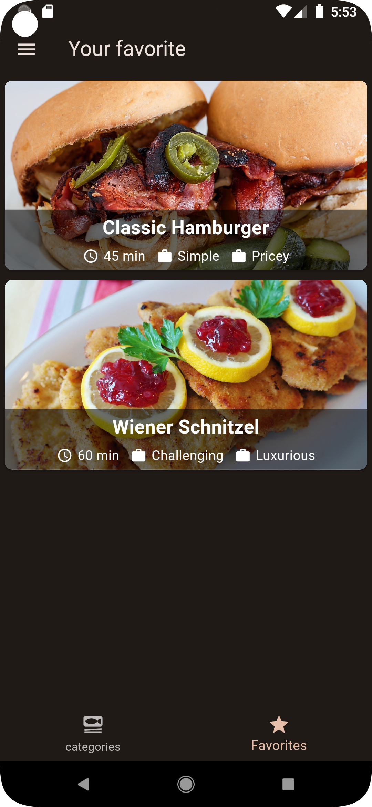
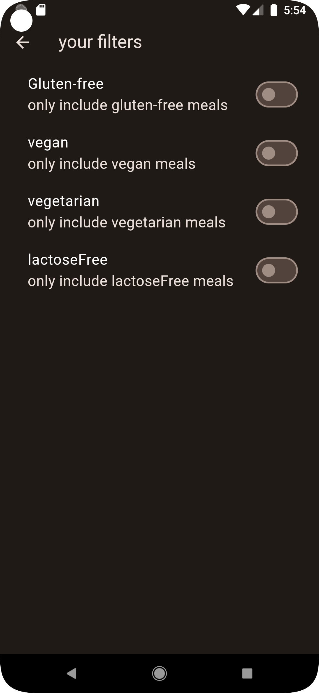
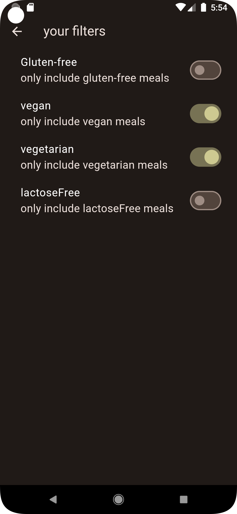

# food recipe Application

a beautifully designed mobile application built with Flutter, 
utilizing the Riverpod state management library and rich animations
for an engaging user experience. This app serves as a comprehensive platform 
for discovering, saving, and sharing delicious recipes from around the world.

## Features

<h3>Discover Recipes</h3>

Browse through a vast collection of recipes with high-quality images and detailed instructions.

<h3>Favorites</h3>

Save your favorite recipes for quick access anytime.

<h3>Interactive Animations</h3>

Enjoy smooth and visually appealing animations that enhance the user experience.

<h3>State Management with Riverpod</h3>

Efficient and scalable state management using Riverpod for a robust and maintainable codebase.

<h3>Recipe Details</h3>

View comprehensive details for each recipe, including ingredients, step-by-step cooking instructions, and nutritional information.

## Technologies Used

<h3>Flutter</h3>

A powerful framework for building natively compiled applications for mobile, web, and desktop from a single codebase.

<h3>Riverpod</h3>

A reactive caching and data-binding framework that makes state management simple and scalable.

<h3>Flutter Animations</h3>

Custom animations for an engaging and intuitive user experience.

<h2>SnapShots</h2>

 

